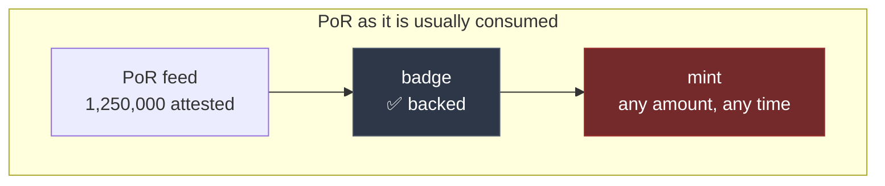
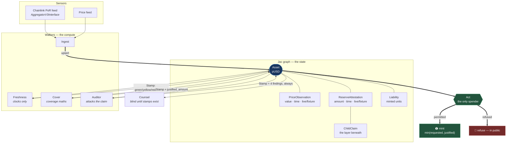
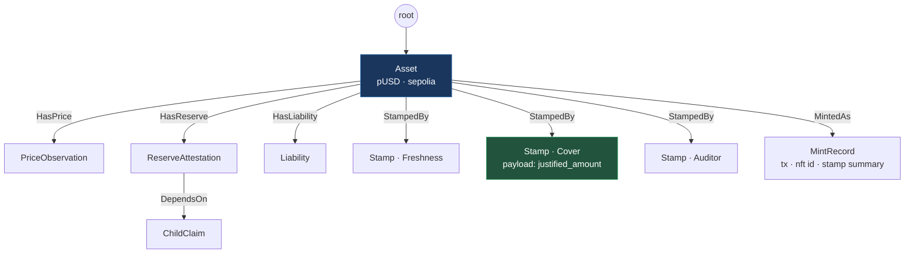
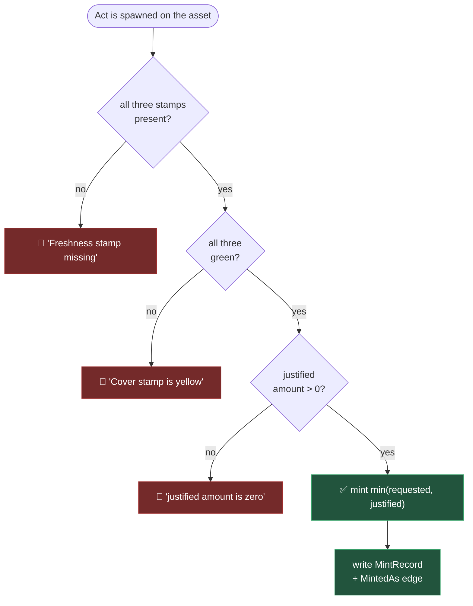
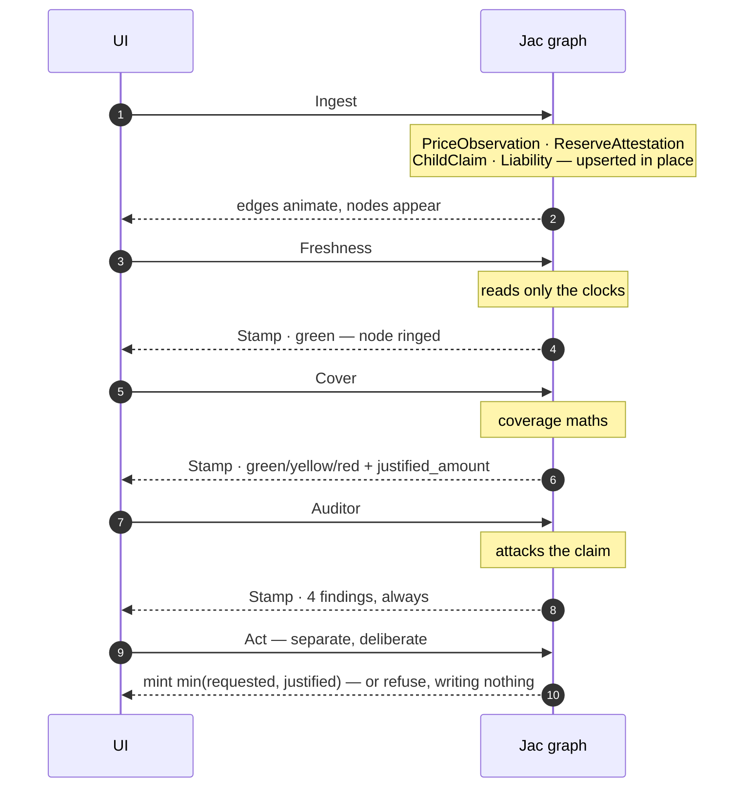

# Proof of Reserve, Jac Enforced

**PoR attests. Jac enforces. The printer is the proof.**

> Proof of Reserve attests that backing was reported. Proof of Reserve, Jac Enforced puts that attestation on a graph, requires three green stamps from walkers that are allowed to attack the claim, and only then mints — only as much as current coverage justifies — so "backed" is a permit with a quantity, not a text output you can quote.

A Chainlink Proof of Reserve attestation arrives. Most systems read the number and display it. **PoRJE walks it** — through three independent approvers, one of which exists to attack the claim — and only then decides whether value may be printed, and how much.

This is not an oracle project. It does not replace Chainlink Proof of Reserve. PoR remains the sensor. This is the runtime that decides whether the attestation is still **actionable**.

---

## The gap: an attestation with no door

Chainlink Proof of Reserve already does the hard job. It publishes that, at a given time, an attested reserve amount existed. That output is a **fact**. The problem is what happens next — nothing has to.

A reserve figure gets read and shown. A badge. Nothing is permitted or refused because of it.



Four ways that is unsafe, and all four look fine on a dashboard:

| Failure | What it looks like | What is actually true |
|---|---|---|
| **Stale attestation** | A live price next to an old reserve | The reserve is no longer a fact about *now* |
| **Punctual but no pulse** | Fresh timestamp every round, amount never moves | A heartbeat with no pulse — a stuck feed |
| **Stale child** | Parent asset reads "backed" | The claim *underneath* it expired |
| **Missing attestation** | An empty field | Treated as absence of data, not a hard stop |

Vaults, mints, collateral listings and basket legs **inherit** "backed" without ever walking what sits underneath. So PoR today is strong as an attestation and weak as a protocol primitive: text you can point at, not a door you have to pass through — and it never decides how much may be printed.

---

## The flow

Keep Chainlink's attestation as the sensor. Put a Jac workflow in front of the printer that the attestation must survive.



Six walkers, one authority each. The first three **cannot mint** — they do not import the EVM bridge at all. The spender is a walker that reads the stamps.

### The object is a graph, not a row



Every verdict is a **node on the graph**. Nothing lives in a chat, a session, or a response body. Restart the server and `GetAsset` still answers — because the graph *is* the state.

---

## The gate: how a mint is permitted

`Act` is the only walker that touches the EVM bridge, and it fails closed at every branch.



**On refusal it writes nothing.** No `MintRecord`, no status change. A refusal is as visible as a mint.

The colour ladder, from `jac/lib/colors.jac`, combined with `min_color` — which always returns the **more severe** of two verdicts:

| Colour | Rank | Meaning | Printer |
|---|---|---|---|
| 🟢 `green` | 0 | pass | open, if all three are green |
| 🟡 `yellow` | 1 | `caution_blocks_printer` | **blocked** |
| 🔴 `red` | 2 | fail | blocked |
| ⚪ `unknown` | 3 | `missing_fact_halt` | blocked |

Two consequences worth stating plainly:

- **Unknown outranks red.** A missing fact is worse than a known failure — a failure at least tells you what is wrong.
- **There is no override.** No knob, no walker, no API parameter lets a yellow stamp mint. The requested amount is a **ceiling**, never a licence to skip a stamp.

---

## The three paths

One call — `DemoControl(path=…)` — seeds the fixtures and runs all three approvers. The printer stays a deliberate, separate act.

### You can watch it happen

`DemoControl` runs all four walkers inside a single frame. That is the right shape for a CLI and for tests, and completely invisible on screen. So the UI does not use it: it sends **four requests** — `Ingest`, `Freshness`, `Cover`, `Auditor` — and refreshes the graph between each.

What that buys you, per click:

- the **edges the current walker traverses animate** in green while it runs;
- its **stamp node takes a green ring** as it lands, then settles;
- a **Walk strip** names the walker on screen, its intent, and the verdict it returned;
- and because the walkers **upsert in place**, you can watch a stamp *change colour without the node moving* — Cover goes 🟢 → 🟡 → 🔴 across three paths at the same coordinates.

The equivalence is asserted, not assumed: `test_stepwise_walk_matches_demo_control` fails if the four-request walk and the one-call path ever disagree on a colour or a graph shape.



| | **Happy** | **Yellow** | **Unknown** |
|---|---|---|---|
| Fixture | `por_live` | `por_flat` + `price_live` | `child_missing` |
| Scenario | healthy reserve | flat reserve **while price moved** | the layer beneath is gone |
| Freshness | 🟢 green | 🟢 green | 🟢 green |
| Cover | 🟢 green | 🟡 yellow | 🔴 red |
| Auditor | 🟢 green | 🟡 yellow | 🔴 red |
| Act | ✅ mints | 🚫 refuses | 🚫 refuses |
| The point | coverage sizes the mint | punctual but no pulse | missing ≠ fine |

### What the printer actually does

With the demo's live-shaped fixtures — reserve **1,250,000**, price **1.0002**, minted units **1,000,000**:

```
coverage ratio 1.25 >= min 1.0
justified amount: 250000.0
```

Ask for **1,000,000**. You get **250,000**.

That gap is the product. The requested amount is what you *want*; coverage is what you are *permitted*. The `MintRecord` stores both, so the difference is auditable on-chain.

---

## Why this is an exceptional use of Jac

Jaseci's premise is that **data and compute are the same graph**. PoRJE takes that literally: the claims are nodes, the walkers are the compute, the stamps are the verdicts, and the mint is a walker that reads the verdicts.

- **Graph-native policy.** An approval is not a boolean in a service — it is a `Stamp` node with a colour, reasons, and a payload, attached by a `StampedBy` edge.
- **Walker-scoped authority.** `Act` is the only walker that imports the EVM bridge. Freshness, Cover and Auditor *cannot* move value, even if compromised, because they do not hold the capability.
- **A blind explainer.** `Counsel` narrates the decision but has no independent access to prices or reserves — its only inputs are the stamp nodes. It **cannot describe a decision the graph does not contain**. Until three stamps exist it returns `{"spoken": false}`.
- **Adversarial visibility.** The Auditor writes all four findings **even when it passes**, so a green claim is still auditable rather than merely reassuring.

### The bug that taught us the semantics

Our first `Ingest` used the obvious re-runnable pattern — delete the old edges, attach a fresh node. Observations then piled up: **1, then 2, then 3** across three runs. No error. The walker reported success.

The cause is a real property of Jac 0.37. `DemoControl` spawns `Ingest`, `Freshness`, `Cover` and `Auditor` as **siblings from one frame**, and each child's commit re-writes the parent's edge set from its own snapshot. So a sibling's `del [edge …]` is silently lost while its attachment is not. Delete-then-create degrades to append-only.

It was not merely untidy. `Freshness` reads the **oldest** surviving observation — so once the accumulated graph aged past `max_price_age_seconds`, the happy path reported 🔴 **red on an asset that had just been refreshed**. A false negative, on a system whose entire claim is that a green means green.

The fix is **upsert in place**: attach only when no edge exists, otherwise mutate the existing node's fields. A mutation has no edge to lose, so the invariant holds regardless of sibling count or commit order. The same pattern holds the one-stamp-per-walker invariant.

We also found a `del [edge here ->:StampedBy:->]` in `DemoControl` whose comment claimed it was load-bearing. It was dead code — removing it changed nothing, because the walkers' upsert was holding the invariant all along. **Zero `del` statements remain in `jac/`.**

Full write-up: [docs/architecture.md](docs/architecture.md#spawned-sibling-commit-semantics).

---

## Proven, not asserted

Everything below was run on **Jac 0.37.23** against a dropped-and-reseeded Postgres store.

```
$ jac check jac/
============================== 24 passed in 5.44s ==============================

$ jac test -d jac/tests
.................                                                        [100%]

17 passed in 15.66s
```

The regression guard is `test_re_ingest_does_not_accumulate_edges` — three happy runs against one asset, asserting exactly one of each observation and exactly three green stamps. `test_stepwise_walk_matches_demo_control` pins the UI's four-request walk to the same verdicts, so the demo cannot drift from the CLI.

**The accumulation fix, over HTTP on a single asset.** Five consecutive runs — including happy *twice on the same asset*, which is the regression test:

| Run | `HasPrice` | `HasReserve` | `DependsOn` | `HasLiability` | `StampedBy` | Stamps |
|---|---|---|---|---|---|---|
| happy #1 | 1 | 1 | 1 | 1 | 3 | 🟢🟢🟢 |
| **happy #2** *(same asset)* | **1** | **1** | **1** | **1** | **3** | 🟢🟢🟢 |
| yellow | 1 | 1 | 1 | 1 | 3 | 🟢🟡🟡 |
| unknown | 1 | 1 | 1 | 1 | 3 | 🟢🔴🔴 |
| happy #3 | 1 | 1 | 1 | 1 | 3 | 🟢🟢🟢 |

Before the fix this column read 1, 2, 3. It is now flat at 1 across five runs — and the third happy run proves the `flat_history` clear works after the flat-reserve path.

Two consecutive `GetAsset` calls returned **identical ids for all seven nodes**, which is also the mechanism that keeps the React Flow node positions stable on screen.

Full results and the operator checklist: [docs/demo-runbook.md](docs/demo-runbook.md).

---

## Run it

Jac 0.37.23 ships as a fused native binary from the [jaseci-labs/jac releases](https://github.com/jaseci-labs/jac/releases) — it is **not** on PyPI (`jaclang` there stops at 0.16.7). Install with `install.sh`, then:

```bash
jac run main.jac --no-client     # serves on :8000
curl -s -o /dev/null -w '%{http_code}\n' localhost:8000/healthz   # → 200
```

> Jac 0.37 has no `jac start`. `/healthz` is the readiness probe; `/health` is 404 and `/docs` is the API page.

Then seed the graph and walk a path:

```bash
jac install                                    # runtime deps into .jac/venv
.jac/venv/bin/python scripts/seed_graph.py     # prints the asset node_id
.jac/venv/bin/python scripts/run_demo_path.py happy
.jac/venv/bin/python scripts/run_demo_path.py yellow
.jac/venv/bin/python scripts/run_demo_path.py unknown
```

The frontend is a Next.js surface over the same HTTP API:

```bash
cd frontend && npm install && npm run dev      # → localhost:3000
```

**Reset the graph** — the store is Postgres, not a file in the repo, and the database name is a hash of the project path, so run this **from the project root**:

```bash
pkill -f "jac run"
jac db drop jac_por_jac_enforced_a3a8aeca -y
jac run main.jac --no-client
```

---

## Repository layout

| Path | What it is |
|---|---|
| `jac/walkers/` | Ten walkers — Ingest, Freshness, Cover, Auditor, Act, Counsel, DemoControl, SeedAsset, GetAsset, GetStamps |
| `jac/schemas/` | Node and edge archetypes — the vocabulary of the claim graph |
| `jac/lib/` | `policy.jac` (every threshold in one dict), `colors.jac`, `fixtures.jac`, `chainlink.jac`, `utils.jac` |
| `jac/tests/` | 17 tests, including the EVM spy that proves the mint decision without a network |
| `contracts/` | `PoRToken` (mint locked to `Act`) and `PoRAttestation` (ERC-721 durable record) |
| `frontend/` | Next.js demo surface — React Flow graph, stamp badges, mint gate |
| `fixtures/` | Schema-faithful JSON inputs, each stamped `"label": "fixture"` |
| `docs/` | [architecture](docs/architecture.md) · [walkers](docs/walkers.md) · [policy](docs/policy.md) · [runbook](docs/demo-runbook.md) |

Every policy threshold lives in one place. Nothing hard-codes a number — [docs/policy.md](docs/policy.md) documents each knob and what changes when you move it.

---

## Status

**Verified:** the type layer (`jac check`, 0 errors across 24 files), the full 17-test suite including the mint-decision spy tests, all three demo paths end to end over HTTP — walked one walker at a time, the way the UI does it — and the one-of-each idempotence invariant across repeated runs.

**Not yet verified — the chain boundary.** `Act` reaches the mint and **fails closed** with `The private key must be exactly 32 bytes long, instead of 0 bytes.` The deployer key and contract addresses in this environment's `.env` are empty (the file carries duplicate keys, and the blank second copy wins), and there is no local anvil or built `artifacts/` fallback. The decision to mint is proven by the spy tests; the transaction itself needs funded credentials. We left it refusing rather than adding a dry-run path, because a manufactured success signal is worse than an honest refusal.

The frontend is verified by build and by HTTP only — no browser session has been run.

Known issues and their fixes are tracked in [docs/demo-runbook.md](docs/demo-runbook.md).

---

## The one sentence

> Proof of Reserve attests that backing was reported. Proof of Reserve, Jac Enforced puts that attestation on a graph, requires three green stamps from walkers that are allowed to attack the claim, and only then mints — only as much as current coverage justifies — so "backed" is a permit with a quantity, not a text output you can quote.

## Authors & Hackathon

Built for **JacHacks 2026** by **Justin Gramke** and **Felix Berinde**.

## License

MIT License — Copyright (c) 2026 Justin Gramke and Felix Berinde.
